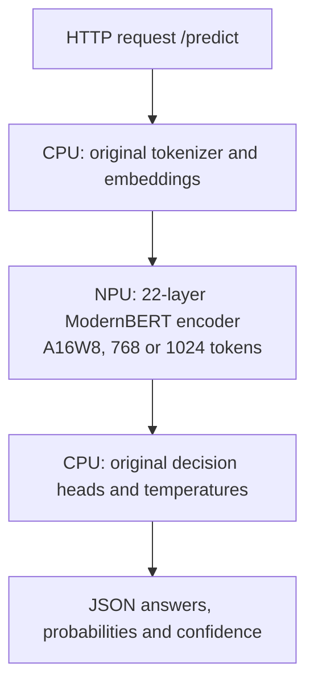

# Laya on Qualcomm Hexagon NPU (Rubik Pi 3)

[](#architecture)
[](#quickstart-guide)
[](#highlights)
[](#implementation)
[](LICENSE)

Deploy the multilingual [Laya decision agent](https://huggingface.co/convaiinnovations/laya) on the **Qualcomm Hexagon HTP V68** in the **Rubik Pi 3 (QCS6490)**. The service provides structured routing, boolean decisions and ordinal scores through a local web interface and FastAPI.

The current implementation prioritizes agreement with original Laya: **3.53% decision mismatch on 1,840 held-out decisions**, and **2.93% across 1,160 additional external decisions**, with actual NPU execution and zero CPU EP fallbacks.

## Highlights

- **Strict NPU encoder:** the 22-layer ModernBERT encoder runs through QNN HTP; unsupported execution fails instead of silently falling back to a CPU provider.
- **Original input capacity:** preserves Laya's 1024-token sequence and 256-token question/head budgets, using 768- and 1024-token graphs without imposing extra truncation.
- **Multilingual structured decisions:** supports `choice`, `noul` and `score`, including English, Traditional Chinese and Simplified Chinese evaluation.
- **Ready-to-use API and UI:** browser demo at `/`, interactive API documentation at `/docs`, and `/health` with readiness, bucket usage and NPU counters.
- **Deployment controls:** persistent QNN context caches, graph/backend hash verification, one active bucket session, and a systemd user service with a 4 GiB memory limit. Measured service peak: **2.56 GiB**.

## Quickstart Guide

### 1. Prepare the Pi environment

Tested with Ubuntu 24.04, Python 3.12, Laya 0.3.5, ONNX Runtime 1.30.0 and `onnxruntime-qnn` 2.5.0. The board image must provide working FastRPC/DSP drivers and `cdsprpcd`:

```bash
ls -l /dev/fastrpc-cdsp
pgrep -a cdsprpcd
```

For a new checkout, use the path expected by the supplied service files:

```bash
git clone --branch main https://github.com/EricYu123456/laya-hexagon-npu.git \
  /home/ubuntu/laya-service
cd /home/ubuntu/laya-service
python3.12 -m venv .venv
source .venv/bin/activate
python -m pip install --upgrade pip
python -m pip install -r requirements.txt
HF_HUB_OFFLINE=0 python download.py
```

An existing configured Pi can reuse its checkout, environment and model files. If deploying under another user or directory, update the paths in [`service.env`](service.env) and [`systemd/laya.service`](systemd/laya.service).

### 2. Prepare the model artifacts

Git contains source code and evaluation reports. **The corrected ONNX graphs and context caches are not bundled or published as current release assets.** Copy a complete compatible model set from an existing deployment, or follow the [WSL/Linux build guide](docs/build-fidelity.md) to export, calibrate and validate both buckets.

| Artifact | Location | How to obtain |
| --- | --- | --- |
| Original checkpoint, tokenizer and configuration | `models/multilingual/` | `python download.py` (pinned checkpoint revision) |
| Corrected 768/1024 ONNX graphs, per-bucket manifests and `.offsets.json` provenance | Paths referenced by the deployment manifest | Copy a compatible set or [build and calibrate](docs/build-fidelity.md) |
| Combined deployment manifest | `npu/fidelity/manifest.json` | Included with the prepared set; [merge and activate](docs/deployment.md) when building a new set |
| Compiled QNN contexts | `npu/fidelity/context_cache/` | Prepare on the Pi in the next step |

Keep graph paths relative to their manifests intact when copying. The configured Pi stores its corrected buckets under `npu/fidelity/qualified-2026-09-29/{768,1024}/`. Each graph is about 112 MiB; the original weights are about 614 MiB, in addition to tokenizer/configuration files.

`download_models.sh`, `build_clamped_22l.py` and the v1.0.0 model asset belong to the older 64-token/clamped implementation. Use the build guide above for the current model set; no ARM cross compiler is required.

### 3. Prepare the context cache

Stop an existing Laya service with `systemctl --user stop laya.service` and finish other NPU jobs before this step. Load the same configuration used by the service:

```bash
cd /home/ubuntu/laya-service
source .venv/bin/activate
set -a
source service.env
set +a
source npu/env.sh
python npu/compile_contexts.py \
  --manifest "$LAYA_NPU_MANIFEST" --verify-reload
```

Initial context preparation takes several minutes and must run **outside the service's 4 GiB cgroup**. The 768 build peaked near 5 GiB; the 1024 build needed temporary swap on the tested board. Cached inference runs without that swap. See [deployment preparation and rollback](docs/deployment.md) for the memory requirements and validation steps.

Always source `npu/env.sh` before direct QNN commands. It selects matching backend, stub and DSP skeleton libraries from the installed QNN wheel. Cache keys bind the graph, runtime and QNN binaries; changing these requires fresh preparation and validation.

### 4. Run and verify

With the environment from step 3 still loaded, start the API in the foreground:

```bash
bash systemd/run-laya.sh
```

In another terminal:

```bash
cd /home/ubuntu/laya-service
curl -f http://127.0.0.1:8000/health
curl -f http://127.0.0.1:8000/predict \
  -H 'Content-Type: application/json' --data-binary @example.json
```

Open `http://<pi-ip>:8000/` for the demo or `http://<pi-ip>:8000/docs` for the API explorer. `/health` becomes ready only after an actual NPU warmup succeeds. Check for `device: "npu"`, `encoder_provider: "QNNExecutionProvider"`, buckets `[768, 1024]`, and `cpu_fallbacks: 0`.

## Running as a Systemd Service

After preparing the models and caches, stop the foreground server and install the user service:

```bash
cd /home/ubuntu/laya-service
install -D -m 644 systemd/laya.service ~/.config/systemd/user/laya.service
systemctl --user daemon-reload
systemctl --user start laya.service
systemctl --user status laya.service
journalctl --user -u laya.service -n 50 --no-pager
```

To start automatically at login, run `systemctl --user enable laya.service`. For unattended startup without a login session, enable lingering with `sudo loginctl enable-linger ubuntu` as well.

The unit reads `service.env`, uses four CPU threads and a single API worker, and enforces `MemoryMax=4G`. Key settings are:

| Setting | Default |
| --- | --- |
| `LAYA_DEVICE` | `npu` |
| `LAYA_CHECKPOINT` | `multilingual` |
| `LAYA_THREADS` | `4` |
| `LAYA_NPU_MANIFEST` | `/home/ubuntu/laya-service/npu/fidelity/manifest.json` |
| `LAYA_NPU_CACHE_DIR` | `/home/ubuntu/laya-service/npu/fidelity/context_cache` |
| `LAYA_NPU_CONTEXT_CACHE` | `1` |

## Architecture



Only the encoder is replaced. Tokenization, input construction, embeddings, decision heads and response formatting remain with original Laya. CPU work in this hybrid pipeline is intentional; **CPU EP fallback for the NPU graph is disabled**.

## Implementation

1. **Preserve the model's input contract.** Select a static bucket large enough for the original collated sequence, with the original local/global attention pattern and head budgets.
2. **Reduce quantization loss.** Use 16-bit activations, per-channel 8-bit projection weights, native GELU, separate GeGLU outlier channels and CLS/rest paths, plus refined attention MatMuls. The 1024 graph also folds LayerNorm affine parameters and materializes compatible static parameters for HTP.
3. **Correct measured hardware offsets.** Zero-input probes measure per-channel HTP Conv offsets; corrected biases and backend fingerprints are saved with each graph. The final outputs are validated on the physical NPU against unchanged FP32 Laya.

See the [build recipes](docs/build-fidelity.md) and [Conv calibration method](npu/CONV_OFFSET_CALIBRATION.md) for implementation details.

## Performance Benchmarks

### Fidelity to Original Laya

The acceptance target is **decision mismatch ≤5% and mean total variation (TV) ≤5%**, with identical tokens and markers. TV measures probability-distribution differences; these are fidelity metrics, **not accuracy against dataset labels**.

| Evaluation | Decisions | Decision mismatch | Mean TV |
| --- | ---: | ---: | ---: |
| [Typed-decisions held-out](reports/qualification-2026-09-29/heldout.json) | 1,840 | **3.53%** | **2.50%** |
| [Typed-decisions complete public split](reports/qualification-2026-09-29/full-public.json) | 2,000 | 3.55% | 2.50% |
| [Synthetic 1024-token inputs](reports/qualification-2026-09-29/long-input-npu.json) | 80 | **0.00%** | **2.06%** |
| [BANKING77: eight fixed intents](reports/external-2026-09-29/banking77-card8-npu.json) | 320 | **2.81%** | **2.55%** |
| [CLINC150: ten domains](reports/external-2026-09-29/clinc150-domain10-npu.json) | 300 | **3.00%** | **2.83%** |
| [MASSIVE: English](reports/external-2026-09-29/massive-en-US-npu.json) | 180 | **3.33%** | **2.26%** |
| [MASSIVE: Traditional Chinese](reports/external-2026-09-29/massive-zh-TW-npu.json) | 180 | **1.67%** | **2.78%** |
| [MASSIVE: Simplified Chinese](reports/external-2026-09-29/massive-zh-CN-npu.json) | 180 | **3.89%** | **2.45%** |
| [External suites combined](reports/external-2026-09-29/summary.json) | 1,160 | **2.93%** | **2.60%** |

All runs above used actual HTP inference with zero CPU EP fallbacks. The 1,840 held-out decisions are a subset of the 2,000-decision public split, excluding calibration/development cases. External tasks use fixed subsets and adapted label spaces; MASSIVE's 540 decisions across three languages share 180 paired IDs. They are not native dataset leaderboard scores. Long-input cases are synthetic extensions of source cases, not another independent natural corpus.

**Remaining limitations:** a separate [15-decision development suite](reports/qualification-2026-09-29/supplementary-development-npu.json) has **1/15 differences (6.67%)** and **0.95% mean TV**, so its decision gate fails. Aggregate passes also do not guarantee a ≤5% error on every input: 204/1,160 external decisions have TV above 5%, with a maximum of 33.55%. Full splits, gold-label results and per-case errors are in the [evaluation method](docs/fidelity-method.md) and [external report](reports/external-2026-09-29/README.md).

### Measured Latency and Memory

| Workload on the Pi | Median | P95 |
| --- | ---: | ---: |
| [External choice tasks](reports/external-2026-09-29/README.md): one question, 768 bucket | **947.6 ms** | **1,008.0 ms** |
| [Typed-decisions](reports/qualification-2026-09-29/full-public.json): five questions per call | **4,764.4 ms** | **5,121.7 ms** |

These are complete `agent.predict` timings with four CPU threads, including tokenization, CPU heads and NPU inference, not isolated encoder/kernel timings or HTTP round trips. External timings retain each process's first cached-session load. Original CPU references ran in WSL, so these results do not establish a same-host speedup.

| Deployment measurement | Result |
| --- | --- |
| QNN cached session load, 768 / 1024 | **1.43 s / 2.19 s** |
| Service cgroup peak / configured limit | **2.56 GiB / 4 GiB** |
| HTTP replay | 15/15 outputs exactly match standalone NPU results |
| Observed service restarts / OOMs / CPU fallbacks during verification | **0 / 0 / 0** |

Session-load times are separate from inference latency and full service startup. [Service evidence](reports/qualification-2026-09-29/deployment.json), [768 cache measurements](reports/qualification-2026-09-29/cache-v2-768.json) and [1024 cache measurements](reports/qualification-2026-09-29/cache-v2-1024.json) preserve the measured conditions. HTTP replay verifies integration; it does not turn the failed 15-decision fidelity gate into a pass.

## API Reference

| Endpoint | Purpose |
| --- | --- |
| `GET /` | Browser demo |
| `GET /docs` | Interactive OpenAPI documentation |
| `GET /health` | Readiness, checkpoint, input capacity and NPU/cache counters |
| `POST /predict` | Evaluate structured questions over a string, object or list state |

Example request:

```json
{
  "state": "My card was charged twice. Please refund the duplicate payment.",
  "questions": {
    "department": {
      "type": "choice",
      "instructions": "Which department should handle this request?",
      "criteria": {
        "billing": "payments, invoices and refunds",
        "technical": "software bugs and outages",
        "sales": "pricing and new purchases"
      }
    },
    "refund_requested": {
      "type": "noul",
      "instructions": "Does the user explicitly request a refund?"
    }
  }
}
```

Responses contain `answers`, `usage`, `elapsed_ms` and `checkpoint`. `choice` returns a selected label and probabilities; `noul` returns a yes/no probability; `score` returns an expected ordinal score with a probability distribution. Each answer includes confidence and action probability.

The HTTP API accepts **1–4 questions**, **2–12 options for choice/score**, and a serialized state of at most **16,000 characters**. Score criteria must be an ordered list. Original Laya's token/head budgets still apply. Invalid requests return 422; concurrent requests receive 503 with `Retry-After: 2` while inference is busy. The five-question and eighteen-option benchmark tasks use the CLI.

## Documentation

- [Build and calibration recipes](docs/build-fidelity.md)
- [Deployment, verification and rollback](docs/deployment.md)
- [Fidelity methodology and reproducible evaluations](docs/fidelity-method.md)
- [Recorded reports and raw outputs](reports/README.md)
- [Historical technical report](npu/REPORT.md) — describes the earlier truncated/clamped model; its latency and accuracy claims do not apply to this version.

## Author & License

- **Author:** Eric Yu ([@EricYu123456](https://github.com/EricYu123456))
- **Code license:** [MIT](LICENSE). Adapted evaluation datasets retain their [source licenses](reports/external-2026-09-29/README.md#sources-attribution-and-licenses).
