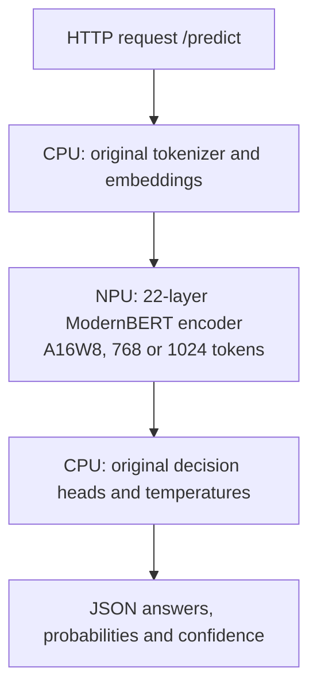

# Laya on Qualcomm Hexagon NPU (Rubik Pi 3

[](#architecture)
[](#quickstart-guide)
[](#highlights)
[](#implementation)
[](LICENSE)

Deploy the multilingual [Laya decision agent](https://huggingface.co/convaiinnovations/laya) on the **Qualcomm Hexagon HTP V68** in the **Rubik Pi 3 (QCS6490)**. The service provides structured routing, boolean decisions and ordinal scores through a local web interface and FastAPI.

The qualified graph set meets **≤1% decision mismatch and ≤1% mean total variation on all nine historical test suites**, with actual NPU execution, identical input tokens and zero CPU EP fallbacks. The complete typed-decisions split has **12/2,000 differences (0.60%)**; the highest suite mean TV is **0.6222%**. The [completed qualification](reports/qualification-2026-10-03/README.md) passes both the Pi audit and a [separate local recomputation](reports/qualification-2026-10-03/independent-audit.json).

## Highlights

- **Strict NPU encoder:** the 22-layer ModernBERT encoder runs through QNN HTP; unsupported execution fails instead of silently falling back to a CPU provider.
- **Original input capacity:** preserves Laya's 1024-token sequence and 256-token question/head budgets, using 768- and 1024-token graphs without imposing extra truncation.
- **Multilingual structured decisions:** supports `choice`, `noul` and `score`, including English, Traditional Chinese and Simplified Chinese evaluation.
- **Ready-to-use API and UI:** browser demo at `/`, interactive API documentation at `/docs`, and `/health` with readiness, bucket usage and NPU counters.
- **Deployment controls:** persistent QNN context caches, graph/backend hash verification, one active bucket session, and a systemd user service with a 4 GiB memory limit. Fresh acceptance measured a **3.594 GiB cgroup peak** with no restart or OOM.

## Quickstart Guide

### 1. Prepare the Pi environment

Tested with Ubuntu 24.04, Python 3.12, Laya 0.3.5, ONNX Runtime 1.30.0 and `onnxruntime-qnn` 2.5.0. The board image must provide working FastRPC/DSP drivers and `cdsprpcd`:

```bash
ls -l /dev/fastrpc-cdsp
pgrep -a cdsprpcd
```

For a new checkout, use the path expected by the supplied service files:

```bash
git clone --branch main https://github.com/EricYu123456/laya-hexagon-npu.git \
  /home/ubuntu/laya-service
cd /home/ubuntu/laya-service
python3.12 -m venv .venv
source .venv/bin/activate
python -m pip install --upgrade pip
python -m pip install -r requirements.txt
HF_HUB_OFFLINE=0 python download.py
```

An existing configured Pi can reuse its checkout, environment and model files. If deploying under another user or directory, update the paths in [`service.env`](service.env) and [`systemd/laya.service`](systemd/laya.service).

### 2. Prepare the model artifacts

Git contains source code and evaluation reports. **The corrected ONNX graphs and context caches are not bundled or published as current release assets.** Copy a complete compatible model set from an existing deployment, or follow the [WSL/Linux build guide](docs/build-fidelity.md) to export, calibrate and validate both buckets.

| Artifact | Location | How to obtain |
| --- | --- | --- |
| Original checkpoint, tokenizer and configuration | `models/multilingual/` | `python download.py` (pinned checkpoint revision) |
| Corrected 768/1024 ONNX graphs, per-bucket manifests and `.offsets.json` provenance | Paths referenced by the deployment manifest | Copy a compatible set or [build and calibrate](docs/build-fidelity.md) |
| Combined deployment manifest | `npu/fidelity/manifest.json` | Included with the prepared set; [merge and activate](docs/deployment.md) when building a new set |
| Compiled QNN contexts | `npu/fidelity/context_cache/` | Prepare on the Pi in the next step |

Keep graph paths relative to their manifests intact when copying. The qualified precision graphs use `npu/fidelity/precision-2026-10-03/{768,1024}/`. The corrected graphs are **225.25 MiB and 225.36 MiB**, respectively; the original weights are about 614 MiB, in addition to tokenizer/configuration files. Retain build/export metadata, weight and affine refinement records, and Conv-offset provenance with the prepared set.

`download_models.sh`, `build_clamped_22l.py` and the v1.0.0 model asset belong to the older 64-token/clamped implementation. Use the build guide above for the current model set; no ARM cross compiler is required.

### 3. Prepare the context cache

Stop an existing Laya service with `systemctl --user stop laya.service` and finish other NPU jobs before this step. Load the same configuration used by the service:

```bash
cd /home/ubuntu/laya-service
source .venv/bin/activate
set -a
source service.env
set +a
source npu/env.sh
python npu/compile_contexts.py \
  --manifest "$LAYA_NPU_MANIFEST" --verify-reload
```

Initial context preparation must run **outside the service's 4 GiB cgroup**. The measured compile-and-reload commands took about 21 minutes for 768 and 83 minutes for 1024, with peak process RSS of **6.54 GiB and 6.59 GiB**. The 1024 build used temporary swap; it was removed before qualification. These are compilation measurements, not steady service memory. See [deployment preparation and rollback](docs/deployment.md).

Always source `npu/env.sh` before direct QNN commands. It selects matching backend, stub and DSP skeleton libraries from the installed QNN wheel. Cache keys bind the graph, runtime and QNN binaries; changing these requires fresh preparation and validation.

### 4. Run and verify

With the environment from step 3 still loaded, start the API in the foreground:

```bash
bash systemd/run-laya.sh
```

In another terminal:

```bash
cd /home/ubuntu/laya-service
curl -f http://127.0.0.1:8000/health
curl -f http://127.0.0.1:8000/predict \
  -H 'Content-Type: application/json' --data-binary @example.json
```

Open `http://<pi-ip>:8000/` for the demo or `http://<pi-ip>:8000/docs` for the API explorer. `/health` becomes ready only after an actual NPU warmup succeeds. Check for `device: "npu"`, `encoder_provider: "QNNExecutionProvider"`, buckets `[768, 1024]`, and `cpu_fallbacks: 0`.

## Running as a Systemd Service

After preparing the models and caches, stop the foreground server and install the user service:

```bash
cd /home/ubuntu/laya-service
install -D -m 644 systemd/laya.service ~/.config/systemd/user/laya.service
systemctl --user daemon-reload
systemctl --user start laya.service
systemctl --user status laya.service
journalctl --user -u laya.service -n 50 --no-pager
```

To start automatically at login, run `systemctl --user enable laya.service`. For unattended startup without a login session, enable lingering with `sudo loginctl enable-linger ubuntu` as well.

The unit reads `service.env`, uses four CPU threads and a single API worker, and enforces `MemoryMax=4G`. Key settings are:

| Setting | Default |
| --- | --- |
| `LAYA_DEVICE` | `npu` |
| `LAYA_CHECKPOINT` | `multilingual` |
| `LAYA_THREADS` | `4` |
| `LAYA_NPU_MANIFEST` | `/home/ubuntu/laya-service/npu/fidelity/manifest.json` |
| `LAYA_NPU_CACHE_DIR` | `/home/ubuntu/laya-service/npu/fidelity/context_cache` |
| `LAYA_NPU_CONTEXT_CACHE` | `1` |

## Architecture



Only the encoder is replaced. Tokenization, input construction, embeddings, decision heads and response formatting remain with original Laya. CPU work in this hybrid pipeline is intentional; **CPU EP fallback for the NPU graph is disabled**.

## Implementation

1. **Preserve the model's input contract.** Select a static bucket large enough for the original collated sequence, with the original local/global attention pattern and head budgets.
2. **Reduce quantization loss.** Both buckets split residual features into calibrated bands, with separate CLS/rest paths within each band, and fold compatible LayerNorm affines. Projection weights use two per-channel INT8 Conv terms; the remaining three learned LayerNorm affines use U16 elementwise arithmetic. Native GELU, GeGLU outlier grouping and refined attention MatMuls remain. Scaling before LayerNorm introduces an epsilon approximation that must pass the FP32 export check.
3. **Correct measured hardware offsets.** Zero-input probes measure per-channel HTP Conv offsets; corrected biases and backend fingerprints are saved with each graph. The final outputs are validated on the physical NPU against unchanged FP32 Laya.

See the [build recipes](docs/build-fidelity.md) and [Conv calibration method](npu/CONV_OFFSET_CALIBRATION.md) for implementation details.

## Performance Benchmarks

### Fidelity to Original Laya

The acceptance target is **decision mismatch ≤1% and mean total variation (TV) ≤0.01 for every required suite and subset**, with identical tokens/markers and strict HTP encoder execution. TV measures probability-distribution differences; these are fidelity metrics, **not accuracy against dataset labels**. The [auditor](docs/one-percent-qualification.md) recomputes the criteria from raw answers rather than accepting older reports' 5% pass flags.

| Evaluation | Decisions | Decision mismatch | Mean TV |
| --- | ---: | ---: | ---: |
| [Typed-decisions complete public split](reports/qualification-2026-10-03/typed-decisions-full-npu.json) | 2,000 | 12/2,000 (**0.6000%**) | **0.4886%** |
| [Supplementary multilingual/long/switching probes](reports/qualification-2026-10-03/supplementary-development-npu.json) | 15 | 0/15 (**0.0000%**) | **0.2205%** |
| [Synthetic 1024-token inputs](reports/qualification-2026-10-03/long-input-npu.json) | 80 | 0/80 (**0.0000%**) | **0.4848%** |
| [BANKING77: eight fixed intents](reports/qualification-2026-10-03/banking77-card8-npu.json) | 320 | 1/320 (**0.3125%**) | **0.4265%** |
| [CLINC150: ten domains](reports/qualification-2026-10-03/clinc150-domain10-npu.json) | 300 | 1/300 (**0.3333%**) | **0.6222%** |
| [MASSIVE: English](reports/qualification-2026-10-03/massive-en-US-npu.json) | 180 | 0/180 (**0.0000%**) | **0.4108%** |
| [MASSIVE: Traditional Chinese](reports/qualification-2026-10-03/massive-zh-TW-npu.json) | 180 | 1/180 (**0.5556%**) | **0.5205%** |
| [MASSIVE: Simplified Chinese](reports/qualification-2026-10-03/massive-zh-CN-npu.json) | 180 | 0/180 (**0.0000%**) | **0.4675%** |
| [Legacy accuracy and service requests](reports/qualification-2026-10-03/legacy-npu.json) | 8 | 0/8 (**0.0000%**) | **0.2087%** |

All nine suites pass separately: **3,263 decisions in 1,593 requests**. The overlapping historical typed held-out subset also passes with **11/1,840 differences (0.5978%) and 0.4884% mean TV**; typed development and both legacy subsets pass their own gates. These are historical regression tests, not a new independent generalization evaluation. External tasks use fixed subsets and adapted label spaces; MASSIVE's three languages share 180 paired IDs. Synthetic long inputs derive from typed source cases. Subsets and translations are not additional independent corpora.

**Scope of the result:** the 1% thresholds apply to aggregate decision mismatch and mean TV, not every probability or answer. Typed-decisions TV has a **1.47% P95 and 10.16% maximum**. The [evaluation method](docs/fidelity-method.md) explains the metrics and preserved historical baselines; the [external dataset report](reports/external-2026-09-29/README.md) documents adaptation and source licenses.

### Measured Latency and Memory

| Same 16 development cases / 80 decisions on the Pi | Mean case latency | Corrected 768 graph |
| --- | ---: | ---: |
| September 29 baseline | 4.764 s | 111.36 MiB |
| Qualified precision recipe | **8.782 s** | **225.25 MiB** |

Improved fidelity costs **84.3% more mean case latency (1.84×)** on this matched development workload and approximately doubles projection storage. The [development evidence](reports/precision-development-2026-10-03/README.md) uses four CPU threads, one warmup case and cached contexts. Timings include tokenization, CPU heads and NPU inference; they are not kernel or HTTP timings. Original CPU references ran in WSL and do not establish a CPU-versus-NPU speedup.

| Build / deployment measurement | Result |
| --- | --- |
| Verified cached reload, 768 / 1024 | **9.75 s / 12.59 s** |
| Compile-and-reload peak process RSS, 768 / 1024 | **6.54 GiB / 6.59 GiB** |
| Service cgroup peak / configured limit | **3.594 GiB / 4 GiB** |
| HTTP replay | **10 requests / 15 decisions**, exact match to standalone NPU |
| Service restarts / OOMs / memory-limit events | **0 / 0 / 0** |

Session reload, compilation, steady inference and service startup are separate measurements. The [768 development bundle](reports/precision-development-2026-10-03/README.md) and [1024 build bundle](reports/precision-build-2026-10-03/README.md) preserve compiler evidence. Fresh [service acceptance](reports/precision-service-2026-10-03/deployment.json) retained the same PID/invocation through replay, with zero CPU fallbacks or cache misses/errors/writes. Swap was zero at the recorded snapshots, and the temporary build swap files were absent; no peak swap usage is claimed.

The selected precision manifest is installed as the default. Acceptance temporarily started the service and then restored its original **inactive/dead** state; use the service commands above when ready to run it. The [HTTP report](reports/precision-service-2026-10-03/service-http.json) and cgroup snapshots document this tested workload, not a guarantee for every future request.

## API Reference

| Endpoint | Purpose |
| --- | --- |
| `GET /` | Browser demo |
| `GET /docs` | Interactive OpenAPI documentation |
| `GET /health` | Readiness, checkpoint, input capacity and NPU/cache counters |
| `POST /predict` | Evaluate structured questions over a string, object or list state |

Example request:

```json
{
  "state": "My card was charged twice. Please refund the duplicate payment.",
  "questions": {
    "department": {
      "type": "choice",
      "instructions": "Which department should handle this request?",
      "criteria": {
        "billing": "payments, invoices and refunds",
        "technical": "software bugs and outages",
        "sales": "pricing and new purchases"
      }
    },
    "refund_requested": {
      "type": "noul",
      "instructions": "Does the user explicitly request a refund?"
    }
  }
}
```

Responses contain `answers`, `usage`, `elapsed_ms` and `checkpoint`. `choice` returns a selected label and probabilities; `noul` returns a yes/no probability; `score` returns an expected ordinal score with a probability distribution. Each answer includes confidence and action probability.

The HTTP API accepts **1–4 questions**, **2–12 options for choice/score**, and a serialized state of at most **16,000 characters**. Score criteria must be an ordered list. Original Laya's token/head budgets still apply. Invalid requests return 422; concurrent requests receive 503 with `Retry-After: 2` while inference is busy. The five-question and eighteen-option benchmark tasks use the CLI.

## Documentation

- [Build and calibration recipes](docs/build-fidelity.md)
- [Deployment, verification and rollback](docs/deployment.md)
- [Fidelity methodology and reproducible evaluations](docs/fidelity-method.md)
- [One-percent historical qualification](docs/one-percent-qualification.md)
- [Recorded reports and raw outputs](reports/README.md)
- [Historical technical report](npu/REPORT.md) — describes the earlier truncated/clamped model; its latency and accuracy claims do not apply to this version.

## Author & License

- **Author:** Eric Yu ([@EricYu123456](https://github.com/EricYu123456))
- **Code license:** [MIT](LICENSE). Adapted evaluation datasets retain their [source licenses](reports/external-2026-09-29/README.md#sources-attribution-and-licenses).
